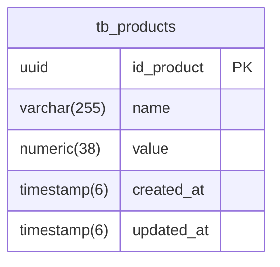

# Spring Boot CRUD API Documentation

## Database Schema


## Overview
Este é um projeto de API RESTful desenvolvido com **Spring Boot**, implementando operações CRUD (Create, Read, Update, Delete) para gerenciamento de produtos.

## Funcionalidades
- **Criar Produto**: Adicione um novo produto com nome e valor
- **Listar Produtos**: Obtenha uma lista de todos os produtos
- **Buscar Produto por ID**: Obtenha detalhes de um produto específico
- **Atualizar Produto**: Atualize os dados de um produto existente
- **Deletar Produto**: Remova um produto pelo ID

## Stack Tecnológica
- **Java 17**
- **Spring Boot 3.3.5**
- **Spring Data JPA**
- **Spring Validation**
- **PostgreSQL**
- **Maven**

## Configuração do Banco de Dados
O projeto utiliza PostgreSQL como banco de dados. Configure as credenciais no arquivo `application.properties`:

```properties
spring.datasource.url=jdbc:postgresql://localhost:5432/products-api
spring.datasource.username=postgres
spring.datasource.password=root
spring.jpa.hibernate.ddl-auto=update
```

## API Endpoints

| Método | Endpoint | Descrição |
|--------|----------|-----------|
| POST | `/produtos` | Cria um novo produto |
| GET | `/produtos` | Lista todos os produtos |
| GET | `/produtos/{id}` | Busca produto por ID |
| PUT | `/produtos/{id}` | Atualiza produto por ID |
| DELETE | `/produtos/{id}` | Remove produto por ID |

## Instalação e Execução

1. **Clone o repositório:**
```bash
git clone https://github.com/CarllosEduardo07/projeto-java-spring-crud.git
```

2. **Navegue até a pasta do projeto:**
```bash
cd projeto-java-spring-crud
```

3. **Configure o banco de dados** no arquivo `application.properties`

4. **Execute o projeto:**
```bash
mvn spring-boot:run
```

## Estrutura do Projeto
```
src/
├── main/
│   ├── java/
│   │   └── com/
│   │       └── example/
│   │           └── crud/
│   │               ├── controllers/
│   │               ├── models/
│   │               ├── dtos/
│   │               └── repositories/
│   └── resources/
│       └── application.properties
```

## Dependências Principais
```xml
<dependencies>
    <dependency>
        <groupId>org.springframework.boot</groupId>
        <artifactId>spring-boot-starter-data-jpa</artifactId>
    </dependency>
    <dependency>
        <groupId>org.springframework.boot</groupId>
        <artifactId>spring-boot-starter-validation</artifactId>
    </dependency>
    <dependency>
        <groupId>org.springframework.boot</groupId>
        <artifactId>spring-boot-starter-web</artifactId>
    </dependency>
    <dependency>
        <groupId>org.postgresql</groupId>
        <artifactId>postgresql</artifactId>
    </dependency>
</dependencies>
```

## Autor
Carlos Eduardo Albuquerque

---
Para mais informações ou suporte, entre em contato com o autor do projeto.
